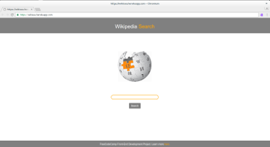

My Portfolio

Think Habit

A mental health app based on sentence completions.

  

    <a href="https://play.google.com/store/apps/details?id=com.thinkhabit" target="_blank">
      Google Play
    </a>
  

  

    <a href="https://itunes.apple.com/us/app/think-habit/id1436381769?ls=1&mt=8" target="_blank">
      App Store
    </a>
  

O2 Balloons

A mobile shopping application that enables balloon artists to learn, market, and sell their creations.

  

    <a href="https://play.google.com/store/apps/details?id=com.o2balloons" target="_blank">
      Google Play      
    </a>
  

  

    <a href="https://itunes.apple.com/us/app/o2-balloons/id1387065496?ls=1&mt=8" target="_blank">
      App Store      
    </a>
  

Link Card

A social networking tool for sharing contact information.

  

    <a href="https://play.google.com/store/apps/details?id=com.network.application.Link" target="_blank">
      Google Play
    </a>
  

  

    <a href="https://itunes.apple.com/us/app/link-card/id1362257137?ls=1&mt=8" target="_blank">
      App Store      
    </a>
  

Enforce

An electronic tire marking applications for parking enforcement.

<a href=" https://docs.google.com/presentation/d/1_CcJLUdc_1SzssXCe3k3Jajj4RGARQh5f35nV4UxnE0/edit?usp=sharing" target="_blank">
  
Enforce Business Plan

</a>

ThinkerToys

A creative thinking generator for systematically building new ideas.

<a href=" https://thinkertoys.herokuapp.com" target="_blank">
  
https://thinkertoys.herokuapp.com
  
</a>

Spinnings

A web game based on the Simon Game with a spin.

<a href=" https://spinnings.herokuapp.com" target="_blank">
  
https://spinnings.herokuapp.com
    
</a>

Toe Tac Tic

A one player versus computer tic-tac-toe game powered by React.js.

<a href=" https://toetactic.herokuapp.com" target="_blank">
  
https://toetactic.herokuapp.com
      
</a>

Visualivez

A visual clicking game based on the Game of Life.

<a href=" https://visualivez.herokuapp.com" target="_blank">
  
https://visualivez.herokuapp.com
      
</a>

Nature Quote Generator

A quote generator with an animating nature backdrop.

<a href=" https://nature-quote-generator.herokuapp.com" target="_blank">
  
https://nature-quote-generator.herokuapp.com
      
</a>

Wikisea

A third-party search tool which utilizes the Wikipedia public REST API.

<a href=" https://wikisea.herokuapp.com" target="_blank">
  
https://wikisea.herokuapp.com
      
</a>

Spell Checkr

A code parsing tool that locates unique variables in order to find pesky typing errors.

<a href=" https://spellcheckr.herokuapp.com" target="_blank">
  
https://spellcheckr.herokuapp.com
      
</a>
