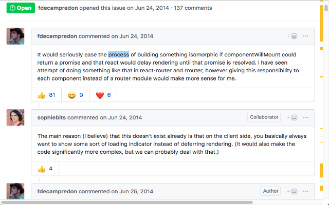

Every developer has visited at least once a "+1" thread, where comment after comment is an endless column of "+1"s and the real solution is somewhere at the bottom or in between the "me too" and the "thanks." Every second spent scrolling or reading something misleading not only does not help the bottom line, but it wastes time in business and in life. This is the reason why developers have a need for Github Highlights, a Chrome Extension that pinpoints positively rated comments inside Github issues. 

Github Highlights automatically detects whether you're in a Github issue and quickly highlights the sections in the page along the scrollbar where positively rated comments are located. It does this quickly and quietly on its own upon loading the page, so you won't have to scroll up and down the thread looking for the best solutions while visually keeping count yourself - this is Github, not Reddit; you want the solution, not a kick and you want it fast. At least I did, and that's why once upon a time I jumped on a moderately well rated solution only to later discover it didn't work and that the better rated solution was at the bottom with quadruple the number of reactions. This extension would've alerted me to that earlier had I used it then.

This "Github Extension" promisingly saves development time and provides a customizable experience. Instead of the default emoji golden color, you can assign your own favorite color, as well as set the width of the highlight to your visual preference - 0 if you want to turn it off.

Along with these options, you can click on a highlight to automatically navigate to that comment in the thread.

It's important to note that going directly to the highest rated comment wouldn't do us any good if the issue doesn't match our problem. Github issues are chronological for a reason and sometimes it means learning to understand the issue before arriving at the best solution. So depending on your use-case, whether you're speeding for delivery or slowing for comprehension, put an emphasis on efficiency for finding thoughtful comments. 

Visit the Chrome Web Store to download the <a href="https://chrome.google.com/webstore/detail/github-highlights/inockplhepiokjcbnhhgknmmpacmpgjj/publish-delayed" target="_blank">Github Highlights</a> extension and speed up your problem solving today into the future. Thank you for reading and if you find this extension helpful, please share it with other developers so we can all find the puzzle pieces faster together!

